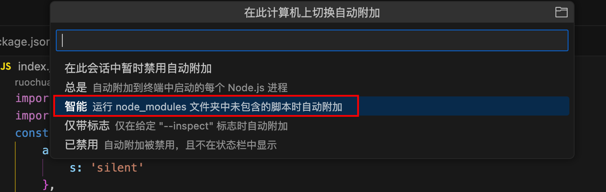
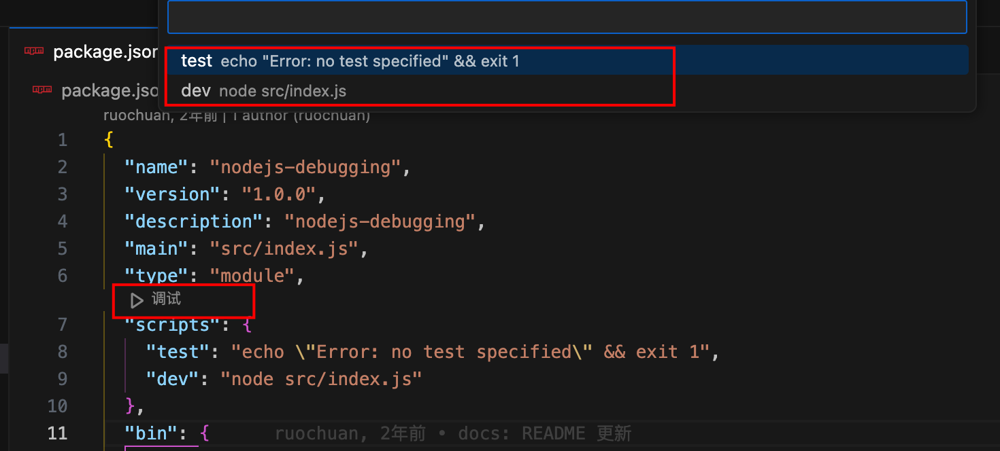
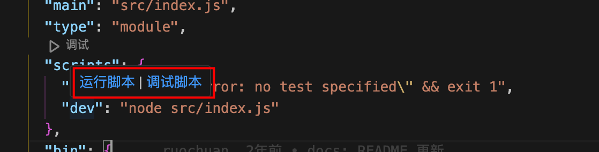
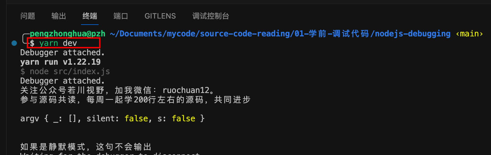
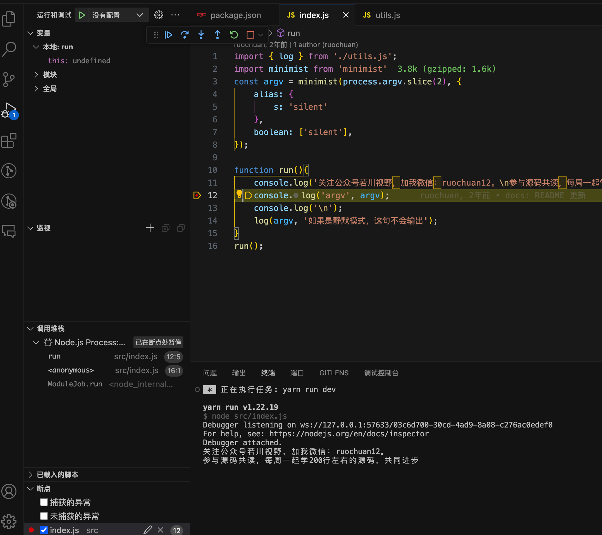

# 如何开始调试

## 1. 配置 auto-attach
VScode 调试 JS 的方法有很多，推荐使用智能模式，无需配置。
首先，按 cmd + shift + p，打开输入 auto attach，点击开始配置调试模式。


然后，选择智能模式即可。



## 2. 调试 nodejs 代码
### 2.1 通过 package.json
打开 package.json 文件，在 scripts 属性上，有个三角图标，点击图标，可以选择需要执行的命令，再次点击命令，即可执行命令。


或者在 scripts 对象里，鼠标滑过每个命令时，会悬浮「运行脚本|调试脚本」按钮，点击按钮，即可执行对应的命令。


### 2.2 通过终端命令
打开终端，ctrl + `，或者查看-终端。直接输入脚本命令，具体是什么命令，看 package.json 文件的 scripts 对象，比如 dev、serve、build，然后执行 npm run dev 或者 yarn dev。


## 3. 调试按钮介绍
添加断点，运行脚本，程序进入断点调试状态，出现调试界面，可以看到调试按钮组、变量、调用堆栈、断点等信息。

1. 继续(F5)，继续执行，直到遇到下一个断点
2. 单步跳过(F10)，跳过当前行，执行下一行，不会执行函数
3. 单步调试(F11)，进入当前行的函数内部调试
4. 单步跳出(shift + F11)，跳出函数

## 4. 其他调试
对于 Vue 等项目，集合了代码压缩工具，需要生成 sourcemap 文件来调试，在配置中设置 devtool 为 source-map。
比如：
``` javascript
module.exports = {
  configureWebpack: {
    devtool: 'source-map'
  }
} 
```

